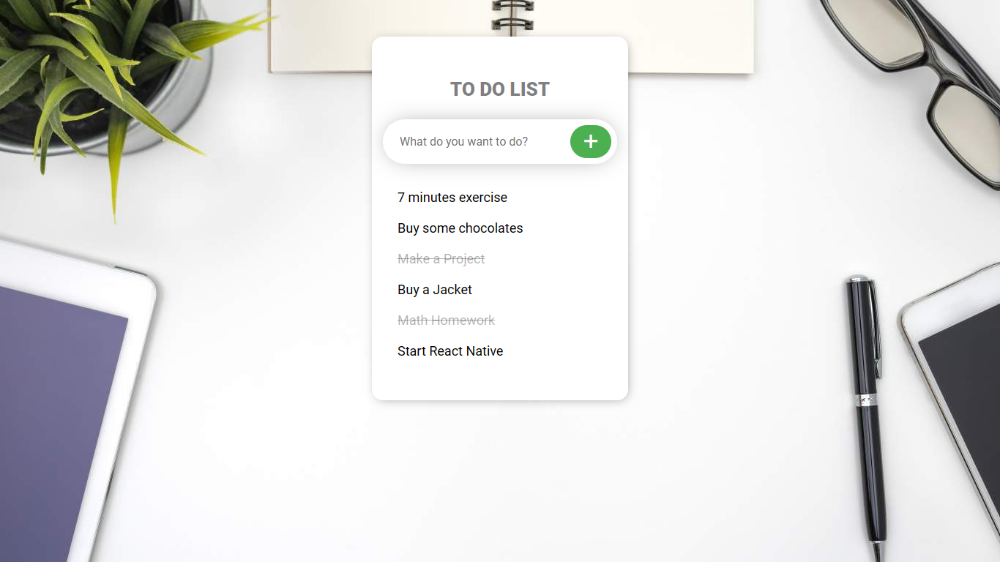

# Angular Todo App

## Project Description:
The Angular Todo App is a simple yet powerful task management application built using the Angular framework. It provides users with a clean and intuitive interface to manage their daily tasks and stay organized.

## Key Features:

* Add, edit, and remove tasks: Users can easily add new tasks, edit existing tasks, and remove tasks they no longer need.
* Task status: Each task can be marked as done or undone, allowing users to track their progress and completion.
* Dynamic updates: The app dynamically updates the task list as users make changes, providing a seamless user experience.
* Responsive design: The app is designed to work flawlessly on different devices, including desktops, tablets, and mobile phones.
* Styling and customization: Users can customize the appearance of the app by applying different themes or adjusting the color schemes.

## Technologies Used:

* Angular: The app is built using the Angular framework, which provides a robust foundation for creating modern web applications.
* HTML/CSS: The app utilizes HTML for structuring the content and CSS for styling and layout.
* TypeScript: Angular uses TypeScript as its programming language, bringing static typing and advanced features to the project.
* GitHub: The app can be hosted on GitHub, enabling collaboration, version control, and easy deployment.
This Angular Todo App is an ideal project for individuals looking to learn Angular or enhance their skills in building responsive and interactive web applications. With its intuitive interface and essential features, it helps users stay organized and manage their tasks efficiently.

*Feel free to explore the source code and contribute to further improvements of this Angular Todo App on GitHub!*
